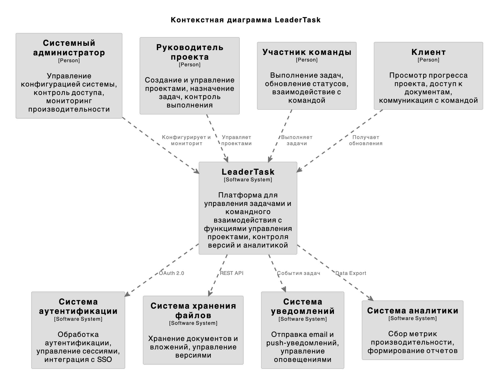
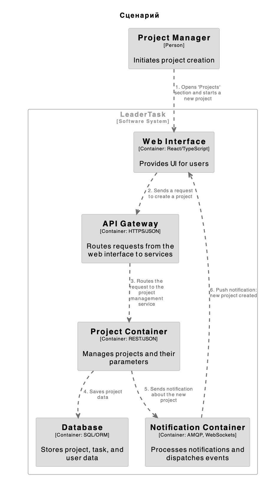
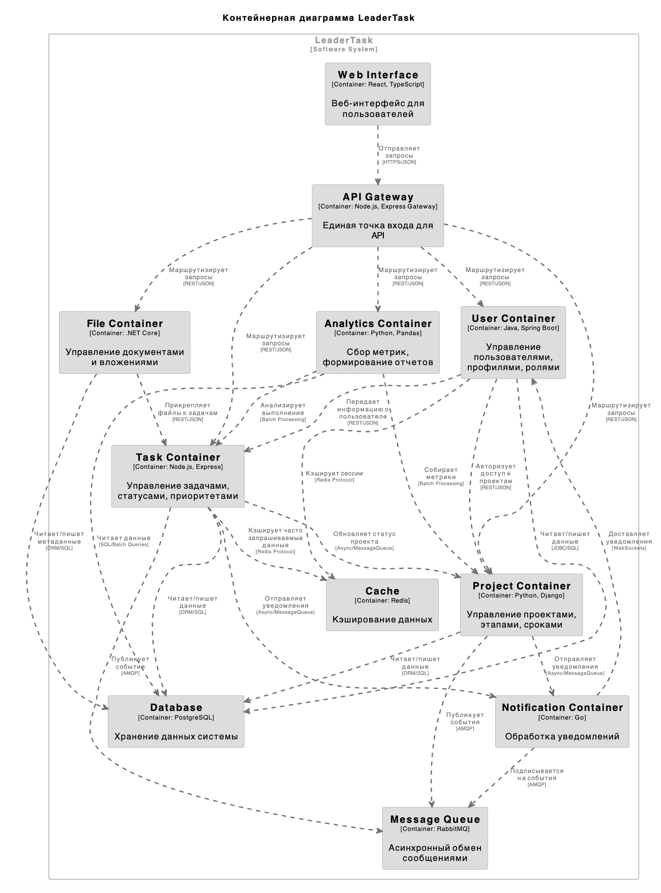

**Исполнил: **Гимазетдинов Дмитрий Русланович

**Группа:** М80-100СВ-24

# Описание архитектуры системы LeaderTask

## Обзор системы

LeaderTask.ru - это платформа для управления задачами и командного взаимодействия, разработанная для оптимизации рабочих процессов и повышения продуктивности организаций.

## Цель системы

Основная цель LeaderTask заключается в предоставлении комплексного решения для:
- Создание пользователей
- Поиск по логину или маске "фамилия/имя"
- Создание целей и задач
- Получение списка целей и задач
- Изменение статуса элементов

## Перечень ролей пользователей

1. Руководитель проекта
   - Создание и управление задач
   - Назначение ролей
   - Назначение задач участникам команды
   - Контроль выполнения проектов
   - Формирование отчетов

2. Участник команды
   - Выполнение назначенных задач
   - Обновление статуса задач
   - Взаимодействие с командой

3. Клиент
   - Просмотр прогресса проекта
   - Получение списка всех целей/задач
   - Предоставление обратной связи
   - Коммуникация с командой

## Внешние системы

1. Система аутентификации
   - Обработка аутентификации пользователей
   - Управление сессиями
   - Интеграция с SSO-провайдерами

2. Система хранения файлов
   - Хранение документов и вложений
   - Управление версиями файлов
   - Обработка общего доступа к файлам

3. Система уведомлений
   - Отправка email-уведомлений
   - Обеспечение push-уведомлений
   - Управление внутрисистемными оповещениями

4. Система аналитики
   - Отслеживание активности пользователей
   - Формирование метрик производительности
   - Создание аналитических отчетов

## Описание SoftwareSystem

LeaderTask реализована как веб-приложение со следующими ключевыми компонентами:

1. Фронтенд-уровень
   - Веб-интерфейс
   - Адаптивный дизайн
   - Обновления в реальном времени

2. Бэкенд-уровень
   - REST API
   - Обработка бизнес-логики
   - Управление данными

3. Уровень базы данных
   - Хранение пользовательских данных
   - Информация о проектах
   - Управление задачами

4. Интеграционный уровень
   - Подключение внешних систем
   - API-endpoints
   - Синхронизация данных

Система построена на микросервисной архитектуре для обеспечения масштабируемости, поддерживаемости и надежности.

## Основные задачи пользователей и их реализация

1. Руководитель проекта
   - Создание новых проектов и определение их параметров
     * Через веб-интерфейс в разделе "Проекты" с использованием Project Management Service
     * Настройка параметров проекта через конфигурационные формы
   - Формирование команды проекта и назначение ролей
     * Интеграция с User Service для управления составом команды
     * Настройка прав доступа через матрицу ролей
   - Установка сроков и milestone'ов
     * Использование календарного планировщика в Task Service
     * Автоматическая синхронизация с календарями участников
   - Мониторинг прогресса и корректировка планов
     * Интерактивные дашборды с real-time обновлениями
     * Интеграция с Analytics Service для отслеживания метрик
   - Генерация отчетов о производительности
     * Автоматическое формирование отчетов через Analytics Service
     * Экспорт данных в различные форматы (PDF, Excel, CSV)

2. Участник команды
   - Просмотр и принятие назначенных задач
     * Персональный таск-борд в Task Service
     * Push-уведомления о новых назначениях через Communication Service
   - Обновление статуса и прогресса выполнения
     * Drag-and-drop интерфейс для управления статусами
     * Автоматическое логирование времени работы
   - Загрузка результатов работы
     * Интеграция с File Service для управления документами
     * Версионирование файлов и контроль изменений
   - Коммуникация с другими участниками
     * Встроенный чат через Communication Service
     * Комментарии к задачам и @-упоминания
   - Планирование личного времени
     * Персональный календарь с синхронизацией
     * Автоматическое распределение нагрузки

3. Клиент
   - Отслеживание статуса проекта
     * Доступ к публичному дашборду проекта
     * Автоматические email-отчеты о прогрессе
   - Утверждение этапов работ
     * Система электронного согласования через Task Service
     * Цифровая подпись документов
   - Предоставление материалов и требований
     * Защищенный портал для загрузки файлов
     * Интеграция с File Service для управления документами
   - Обсуждение изменений и корректировок
     * Выделенный канал коммуникации в Communication Service
     * Система управления изменениями с версионированием

## Перечень контейнеров

1. User Container
   - Обработка регистрации и аутентификации пользователей
   - Управление профилями пользователей
   - Контроль прав доступа и ролей
   - Валидация пользовательских операций

2. Task Container
   - Создание и управление задачами
   - Отслеживание статусов и приоритетов задач
   - Назначение исполнителей
   - Обновление прогресса выполнения

3. Project Container
   - Управление проектами и их параметрами
   - Контроль этапов и сроков проекта
   - Координация командной работы
   - Мониторинг общего прогресса

4. Notification Container
   - Обработка системных уведомлений
   - Отправка email-оповещений
   - Управление push-уведомлениями
   - Координация коммуникаций между участниками

5. File Container
   - Управление документами и вложениями
   - Контроль версий файлов
   - Обеспечение доступа к файлам
   - Организация хранения данных

6. Analytics Container
   - Сбор и анализ метрик
   - Формирование отчетов
   - Мониторинг производительности
   - Генерация статистики

## Взаимодействие между контейнерами в системе LeaderTask

### Взаимодействие веб-интерфейса с API Gateway
- **Web Interface → API Gateway**: Отправляет запросы (HTTPS/JSON)
  - Веб-интерфейс на React/TypeScript взаимодействует с API Gateway через защищенные HTTPS-запросы в формате JSON

### Взаимодействие API Gateway с микросервисами
- **API Gateway → User Container**: Маршрутизирует запросы (REST/JSON)
- **API Gateway → Task Container**: Маршрутизирует запросы (REST/JSON)
- **API Gateway → Project Container**: Маршрутизирует запросы (REST/JSON)
- **API Gateway → File Container**: Маршрутизирует запросы (REST/JSON)
- **API Gateway → Analytics Container**: Маршрутизирует запросы (REST/JSON)

### Взаимодействие между микросервисами
- **User Container → Task Container**: Передает информацию о пользователе (REST/JSON)
- **User Container → Project Container**: Авторизует доступ к проектам (REST/JSON)
- **Task Container → Project Container**: Обновляет статус проекта (Async/MessageQueue)
- **Task Container → Notification Container**: Отправляет уведомления (Async/MessageQueue)
- **Project Container → Notification Container**: Отправляет уведомления (Async/MessageQueue)
- **File Container → Task Container**: Прикрепляет файлы к задачам (REST/JSON)
- **Analytics Container → Project Container**: Собирает метрики (Batch Processing)
- **Analytics Container → Task Container**: Анализирует выполнение (Batch Processing)
- **Notification Container → User Container**: Доставляет уведомления (WebSockets)

### Взаимодействие с базой данных
- **User Container → Database**: Читает/пишет данные (JDBC/SQL)
- **Task Container → Database**: Читает/пишет данные (ORM/SQL)
- **Project Container → Database**: Читает/пишет данные (ORM/SQL)
- **File Container → Database**: Читает/пишет метаданные (ORM/SQL)
- **Analytics Container → Database**: Читает данные (SQL/Batch Queries)

### Взаимодействие с кэшем
- **Task Container → Cache**: Кэширует часто запрашиваемые данные (Redis Protocol)
- **User Container → Cache**: Кэширует сессии (Redis Protocol)

### Взаимодействие с очередью сообщений
- **Task Container → Message Queue**: Публикует события (AMQP)
- **Project Container → Message Queue**: Публикует события (AMQP)
- **Notification Container → Message Queue**: Подписывается на события (AMQP)

# Контекстная диаграмма (systemContext)

# Архитектурно значимый вариант использования

# Контейнерная диаграмма 

